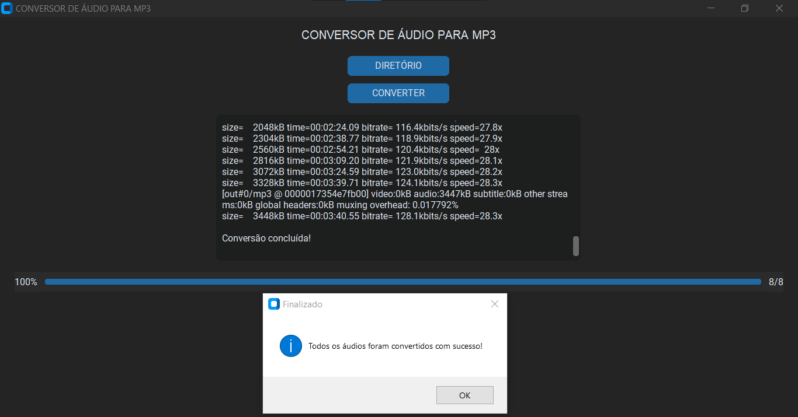
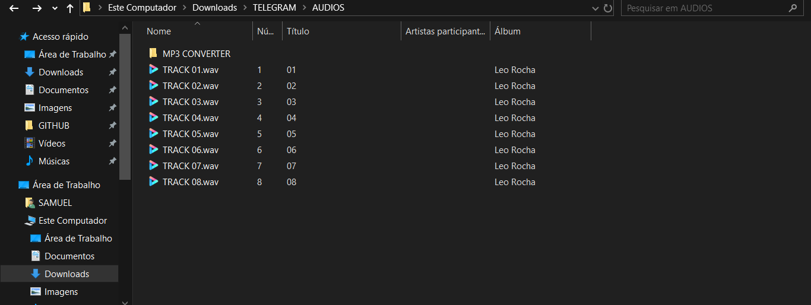
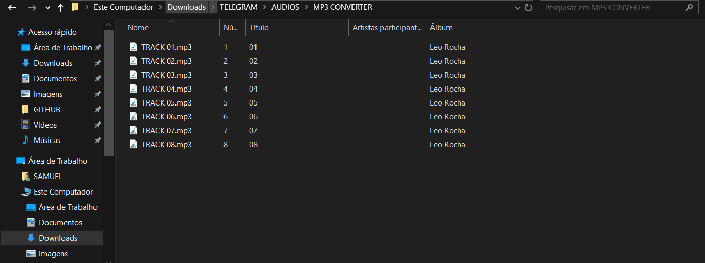

# MP3 CONVERTER
📱É ESPECIALMENTE ÚTIL PARA TORNAR ARQUIVOS COMPATÍVEIS COM QUALQUER DISPOSITIVO DE ÁUDIO, COMO APARELHOS ANTIGOS, CARROS, PLAYERS PORTÁTEIS E CELULARES QUE SÓ ACEITAM MP3 NO FORMATO MAIS COMUM.

 <br>
 <br>
 <br>

## DESCRIÇÃO:
Este aplicativo converte automaticamente arquivos de áudio de diversos formatos (incluindo `.wav`, `.ogg`, `.flac`, `.aac`, `.m4a`, `.wma`, `.alac`, `.opus`, `.mp4`, `.mov`, e `.mp3`) para o formato `.mp3` padrão, utilizando a ferramenta `ffmpeg`.
É especialmente útil para tornar arquivos compatíveis com qualquer dispositivo de áudio, como aparelhos antigos, carros, players portáteis e celulares que só aceitam MP3 no formato mais comum.

## FUNCIONALIDADES:
* **Interface gráfica moderna (dark mode)** usando `customtkinter`.
* **Seleção de diretório** contendo arquivos de áudio.
* **Conversão automática** para MP3 padrão, mesmo de arquivos `.mp3` modernos que podem não ser compatíveis com todos os dispositivos.
* **Criação de uma nova pasta** chamada `MP3 CONVERTER` no mesmo diretório para salvar os arquivos convertidos.
* **Barra de progresso** e contador de arquivos convertidos.
* **Área de status com logs em tempo real** (exibindo o progresso e mensagens do `ffmpeg`).
* **Mensagens de erro e alertas** amigáveis caso nenhum arquivo válido seja encontrado.
   
## COMO USAR?
1. **Instale as bibliotecas necessárias:** Antes de executar o app, certifique-se de instalar todas as dependências necessárias. No terminal, execute o seguinte comando para instalar as dependências listadas no arquivo requirements.txt em `CODIGO`:
   ```bash
   pip install -r requirements.txt
   ```

2. **Instalar `ffmpeg`:** O App depende da ferramenta externa chamada `ffmpeg` para converter os arquivos de áudio.

   1. **Baixar `ffmpeg`:**
      - Vá para o site oficial: [https://ffmpeg.org/download.html](https://ffmpeg.org/download.html).
      - Na seção de downloads, clique em "Windows builds from gyan.dev" ou um equivalente.
      - Baixe o arquivo ZIP de uma versão estável, por exemplo: `ffmpeg-git-full.7z`.

   2. **Extrair o `ffmpeg`:**
      - Extraia o conteúdo do arquivo baixado para uma pasta em seu computador, como `C:\ffmpeg`.

   3. **Adicionar `ffmpeg` ao caminho (PATH):**
      - Abra o **Painel de Controle** e vá para **Sistema e Segurança** > **Sistema** > **Configurações avançadas do sistema**.
      - Clique em **Variáveis de Ambiente**.
      - Em **Variáveis de Sistema**, selecione a variável **Path** e clique em **Editar**.
      - Adicione uma nova entrada com o caminho completo para a pasta `bin` dentro da pasta onde você extraiu o `ffmpeg`, por exemplo: `C:\ffmpeg\bin`.
      - Clique em **OK** e feche as janelas.

   4. **Verificar a instalação:**
      - Abra o Prompt de Comando e digite `ffmpeg` para verificar se está funcionando corretamente. Você deve ver uma lista de comandos suportados se tudo foi configurado corretamente.

3. **Executar o APP:** 
   - Execute o app iniciando-o com o seguinte comando no diretório `./CODIGO`:
   ```bash
   python CODIGO.py
   ```

4. Clique no botão **"DIRETÓRIO"** e selecione a pasta que contém os arquivos de áudio que deseja converter.

5. Clique no botão **"CONVERTER"** para iniciar a conversão.

6. Acompanhe o progresso na barra inferior e veja os detalhes na caixa de status.

7. Ao final, uma mensagem será exibida informando que a conversão foi concluída.

8. Os arquivos `.mp3` convertidos estarão na subpasta **"MP3 CONVERTER"** criada automaticamente no diretório selecionado.

## SOBRE O EXECUTAVEL:
### 1. EXECUTANDO:
- Este arquivo executável está disponível apenas para `Windows X64`. Para executá-lo, basta dar dois cliques. O executável é bastante útil caso o Python não esteja instalado. Trata-se da mesma aplicação do arquivo `CODIGO.py`. Se desejar, você pode recompilá-lo novamente; é para isso que forneci o arquivo `imagem.ico`.

**"Observação: Certifique-se de que o `ffmpeg` esteja instalado e adicionado à variável de ambiente PATH do sistema para que o executável funcione corretamente."**

### 2. GERANDO:
   **1. Instalação do [PyInstaller:](https://pyinstaller.org/en/stable/)**
   - Certifique-se de ter o PyInstaller instalado. Se não tiver, instale usando o comando abaixo:
   ```bash
   pip install pyinstaller
   ```

   **2. Gerando o Executável:**
   - Para gerar o executável, utilize o comando `pyinstaller` seguido de opções:
      - `--icon="imagem.ico"`: Especifica o ícone do executável.
      - `-w`: Especifica que o executável será do tipo "windowed", ou seja, sem exibir uma janela de console.
      - `-F`: Gera um único arquivo executável em vez de vários.
      - `CODIGO.py`: Substitua "CODIGO.py" pelo nome do seu arquivo Python principal.
   ```bash
   pyinstaller --icon="imagem.ico" -w -F CODIGO.py
   ```

## NÃO SABE?
- Entendemos que para manipular arquivos em muitas linguagens, é necessário possuir conhecimento nessas áreas. Para auxiliar nesse aprendizado, oferecemos cursos gratuitos disponíveis:
* [CURSO DE PYTHON](https://github.com/VILHALVA/CURSO-DE-PYTHON)
* [CURSO DE CUSTOMTKINTER](https://github.com/VILHALVA/CURSO-DE-CUSTOMTKINTER)
* [CONFIRA MAIS CURSOS](https://github.com/VILHALVA?tab=repositories&q=+topic:CURSO)

## CREDITOS:
- [PROJETO CRIADO PELO VILHALVA](https://github.com/VILHALVA)
